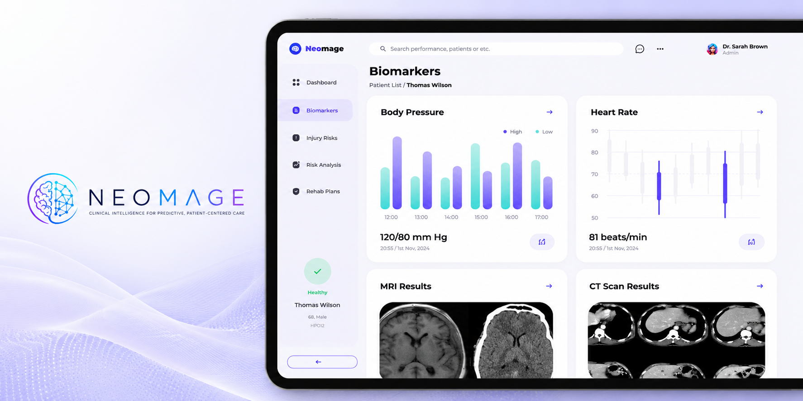

# Neomage

## Multimodal Clinical Intelligence Platform

**Transforming fragmented healthcare data into actionable clinical intelligence.**

  

# Neomage

## Clinical AI Platform for Patient Risk Intelligence

Neomage is a clinical AI platform designed to help healthcare teams make better use of fragmented patient data.

The platform connects clinical records, imaging, biomarkers and physiological signals into a unified intelligence layer for patient risk prediction and clinician-in-the-loop decision support.

This public repository presents the technical direction behind Neomage.  
The production implementation, models, datasets and commercial infrastructure remain private.

---

# What this repository demonstrates

- Clinical AI systems architecture
- Patient risk prediction workflows
- Real clinical data pipeline development
- Machine learning workflow design
- Multimodal AI architecture
- FastAPI backend architecture
- AI-native software development

---

# Current Technical Work

The private implementation includes:

- Modular FastAPI backend
- REST API services
- OAI clinical data pipeline
- Cohort construction
- Feature engineering
- Outcome generation
- Validation framework
- Random Forest, XGBoost and LASSO model training
- Multimodal inference services
- TKA clinical intelligence module
- SQLAlchemy persistence
- Docker support

---

# Development Status

## Implemented

✅ Clinical AI backend

✅ REST API services

✅ Real OAI clinical data pipeline

✅ Cohort construction and feature engineering

✅ Machine learning training pipeline

✅ Model validation framework

✅ Multimodal inference architecture

✅ TKA clinical intelligence module

## In Progress

🚧 Unified clinical intelligence layer

🚧 Clinical workflow integration

🚧 Model deployment

🚧 External clinical validation

🚧 Hospital pilot preparation

---

# Technology Stack

| Layer | Technology |
|--------|------------|
| Language | Python |
| Backend | FastAPI |
| AI / ML | PyTorch, Scikit-learn |
| Models | Random Forest, XGBoost, LASSO |
| Database | PostgreSQL / SQLAlchemy |
| APIs | REST |
| Infrastructure | Docker |
| Healthcare | FHIR-ready architecture |

---

# My Role

Founder, AI Systems Architect and hands-on technical builder.

I designed the platform architecture, clinical AI workflows, backend structure and data pipeline strategy while leading implementation through AI-native development workflows using coding agents.

---

# Repository Scope

This public repository is a technical showcase.

Included:

- Architecture overview
- Engineering approach
- Technology stack
- Public documentation
- Product direction

Excluded:

- Proprietary source code
- Production machine learning models
- Clinical datasets
- Commercial integrations
- Internal infrastructure

---

© Neomage Ltd.